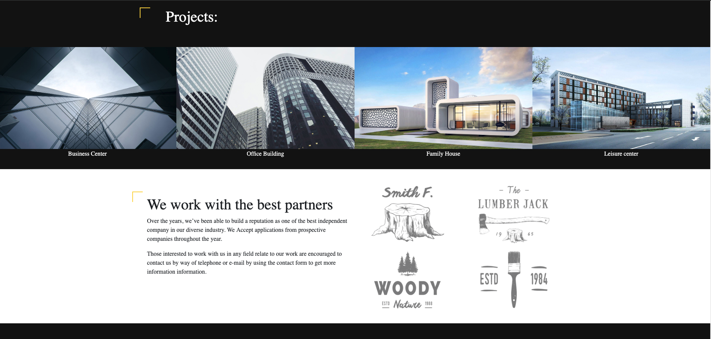
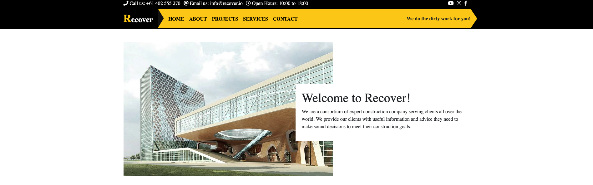
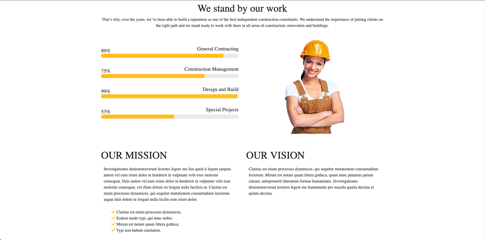
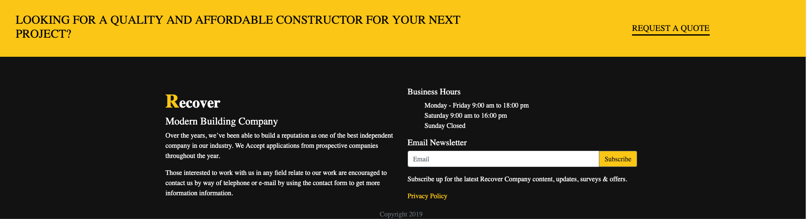
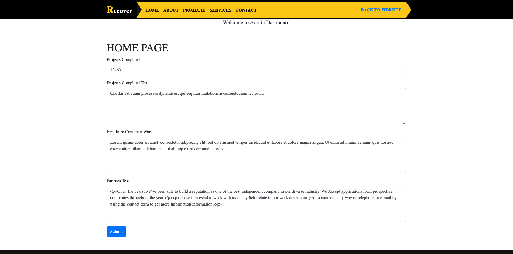

MultiPurpise CMS website.

This was a project for Galvanize. Working pages are HOME, ABOUT and /admin pages. 

App created with EJS + Express + Knex + SQL. Deployed on Heroku.

Link: https://cms-recover-website.herokuapp.com/

I'm using free version Heroku for this app, please wait load first time. 

HOME PAGE

ABOUT PAGE

ADMIN DASHBOARD

-unfinished

